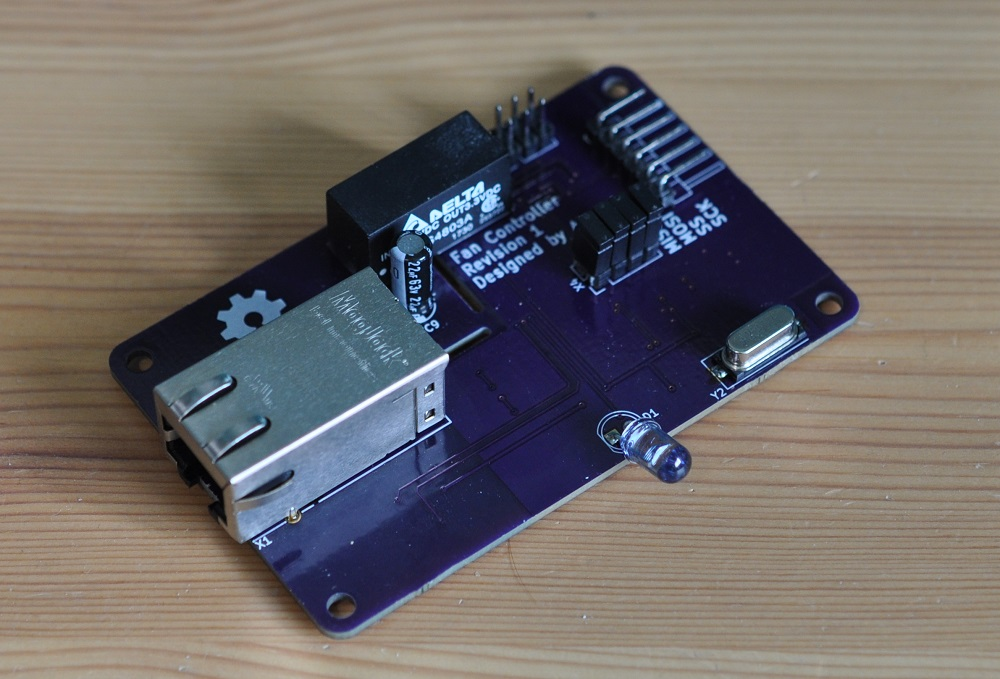
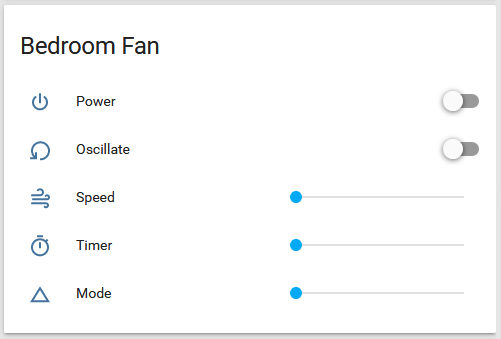

## IR Fan Controller

### What is it?
This project is an Ethernet connected IR remote control for a the Seville classics ultra slimline tower fan, but it can be easily adapted to control other IR devices.  

### Why?
To connect my fan to Home Assistant so that it can turn on automatically when it gets hot, and turn off automatically when I leave home.

#### Why PoE?
Wireless home automation devices often make sense only when they are battery powered, if a power cable needs to be run it can carry data too.  Designing a low power wireless device is far more complicated than designing a wired device and running an Ethernet cable.

## Overview
Home Assistant → MQTT Broker → W5100 (Ethernet) → ATMega328P (MCU) → IR LED

The controller takes the states of the power, oscillation, mode, timer, and speed from Home Assistant.  These values are used to build the IR code then transmit it through the IR LED.

## Project Contents
* FanController_ArduinoCode - firmware for the ATMega328P
* FanController_Guide - reverse engineering guide for IR codes
* FanController_HomeAssistant - example Home Assistant configuration
* FanController_KiCAD - schematic and PCB
* FanController_Media - photos

## Software Used
* [KiCad](http://kicad.org/)
* [Arduino IDE](https://www.arduino.cc/en/Main/Software)
* [OpenSCAD](http://www.openscad.org/)
* [Libre Office](https://www.libreoffice.org/)
* [Home Assistant](https://www.home-assistant.io/)

### Arduino Libraries used
* [Arduino MQTT Client](https://github.com/knolleary/pubsubclient)
